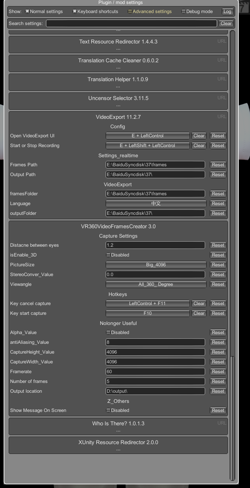
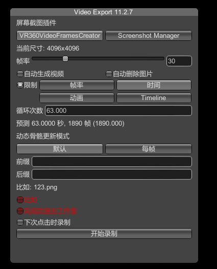

# HS2Plugin_VR_360_degree_capture

This plugins is useful when you try to capture 360-degree panoramic pictures even without a VR device.
(Work fine in Game or Studio!)
Start the Studio normally before copy the release files into BepInEx\Plugins. Press F1 key to show the configration UI of this plugin.

By the VideoExport function provided by [HSPlugins](https://github.com/IllusionMods/HSPlugins), It's possible to capture 360-degree panoramic pictures continually. However slightly modification of the source code of HSPlugins-r2.4\VideoExport.Core\VideoExport.cs is necessary. The modification version of the source-code of VideoExport.cs is attach in this repo.

This repo is focused on 360-degree panoramic pictures capturing.
** This plugin is focused on Honey Select 2. It should work in Honey Select, but I didn't test it.

If you only want to capture 360-degree panoramic pictures, you only need to use VR360VideoFramesCreator.dll. 
If you need to automatically capture video frames, you'll need to deploy VideoExport.dll as well. 
Please use the rewritte code version to rebuild the "VideoExport" project provided by HSPlugins.

As long as you start the studio, you should have the plugin config UI like these:

.

With the VR video frames you captured, you could generate the MMD video in the HS2 studio by using some video making tools.
FFmpeg is a good choice by the way.

[Sample_Video](https://share.utovr.com/151312095032.html)

